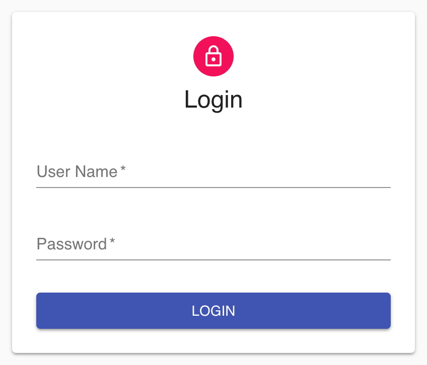

# React 阶段测试

## 具体要求

### 1. 实现登陆页面
用户输入用户名和密码，点击登陆按钮进行提交，登陆所用接口为**utils.js**文件下的**fetchLogin**方法.

### 2. 完成登陆逻辑
- 登陆成功后进入 Dashboard 页面，并要求全局保存登陆返回信息。
- 登陆失败时，要求将**fetchLogin**返回的错误信息在登陆页面显示出来。
- 在登陆过程中LogIn按钮需保持禁用状态(disabled)，且显示文字变为 **Login...**。

### 3. Dashboard头部工具栏
- 用户进入 Dashboard 页面后在头部工具栏显示 Hello + 登陆时**fetchLogin**返回的用户名称，例如：若返回 username = “admin”，则显示 Hello admin
- 头部工具栏具有 LOGOUT 按钮，点击后注销登陆信息，同时返回登陆页面

### 4. Dashboard Todos表单及列表
- 用户进入 Dashboard 页面后，根据 userId 发送 fetch 请求，并对返回结果数据进行过滤，要求以列表的形式显示所有 completed 为 false 的 title 信息。fetch 请求的 url 为 http://jsonplaceholder.typicode.com/todos?userId={userId} ，请求method为GET，其中请求参数 userId 为登陆时动态获取并保存在全局。
- 用户可以对列表数据进行动态删除和新增。
- 在每次新增和删除时，以 console.log 的形式打印当前列表的长度。